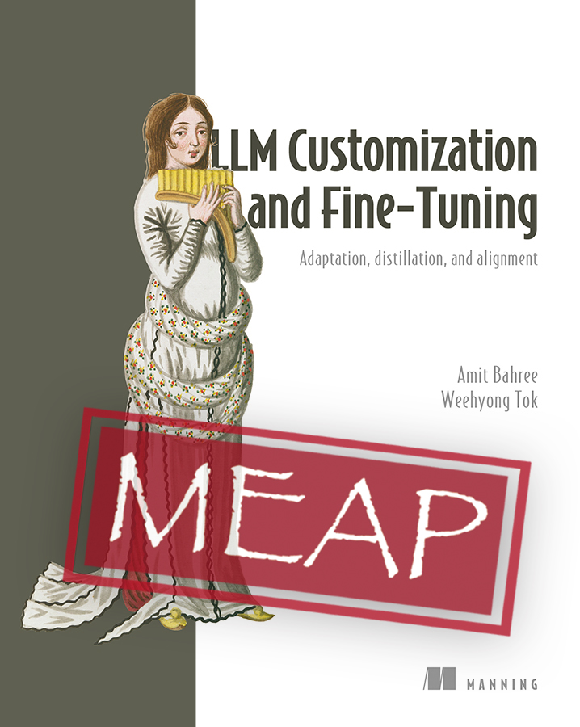

# LLM Customization and Fine-Tuning: Adaptation, Distillation, and Alignment

<table border="0"><tr>
<td valign="top">

*From a prompt to a fine-tuned, aligned, monitored assistant: every technique for adapting an open-weights LLM to your domain, on a single GPU, with reproducible numbers and the honesty to show when a technique does not win.*

**Available now in Manning's [Early Access Program (MEAP)](https://www.manning.com/books/llm-customization-and-fine-tuning):** read the chapters as they are released, run the code alongside them, and get the full ebook and print edition on publication.

**Read it on Manning → [manning.com/books/llm-customization-and-fine-tuning](https://www.manning.com/books/llm-customization-and-fine-tuning)**

</td>
<td width="250" valign="top">
<a href="https://www.manning.com/books/llm-customization-and-fine-tuning"></a>
</td>
</tr></table>

Welcome to the code repository for **LLM Customization and Fine-Tuning: Adaptation, Distillation, and Alignment** (Manning Publications).

This repository contains all the runnable code, data, and examples from the book, organized by chapter.

It is a hands-on, cost-aware playbook for turning a general-purpose open-weights LLM into a focused, cheaper, privately hosted system that beats a generic API call on your domain, and for keeping it reliable in production. Every technique is backed by runnable code that reproduces the book's measured results on a single GPU.

**Book Publisher:** Manning Publications, available now in [Early Access (MEAP)](https://www.manning.com/books/llm-customization-and-fine-tuning)
**Repository:** <https://github.com/bahree/ModelAdaptationBook>

> **Get started in minutes.** Jump to the **[Quick start](#quick-start)** (clone, install for your accelerator, smoke-test), then [`code/README.md`](code/README.md) for the full environment setup. Your first LoRA fine-tune (chapter 2) runs in **under 10 minutes on a single 12 GB GPU**, or on Apple Silicon.

> **No training GPU?** Pull the trained models from [Hugging Face](https://huggingface.co/bahree/ModelAdaptationBook) and run inference or evaluation on any machine. See [Running without training](ACCELERATORS.md#running-without-training-pull-the-model-from-hugging-face).

## About the book

This book is a practitioner's playbook for adapting large language models to specific use cases in a production setting. It covers the full customization spectrum, from prompting (chapter 4) through parameter-efficient fine-tuning (chapter 5), full supervised fine-tuning (chapter 6), distillation (chapter 7), preference optimisation (chapter 8), and the operational layer that keeps a fine-tuned model honest in production (chapter 9). By the last chapter you have taken one model, Qwen3-4B, from a base model through LoRA, full SFT, distillation, and DPO alignment, and into a drift-and-safety-monitored deployment, measuring cost and quality at each step.

![The whole-book arc as one diagram: a base model (Qwen3-4B) moves left to right through the adaptation spectrum with increasing depth (few-shot/RAG in chapter 4, LoRA/QLoRA in chapter 5, full SFT in chapter 6, distillation in chapter 7, DPO alignment in chapter 8) into a focused domain assistant that is cheaper, private, and monitored. The spectrum sits on a data foundation (chapter 3: quality, attribution, splits) and under an operations layer (chapter 9: monitor, drift, rollback, retrain), and every step runs on a single GPU with reproducible, measured results.](assets/book-hero.png)

### The problem it solves

Most teams reach for a general-purpose API and then hit a wall: it is expensive at scale, it sends data outside walls it should not cross, it is too slow for the latency budget, or it simply does not know the domain, the house terminology, or the internal tools. The fix is to adapt a model you control, but that opens a thicket of questions. Prompt, retrieve, or fine-tune? LoRA, full SFT, distillation, or alignment? What will it cost, what data do you need, and how do you keep it from regressing after launch? This book grew out of answering the same enterprise question over and over, "we have a use case and a GPU budget, which adaptation technique and how?", and turning the answer into one reproducible, honest reference: a cost-aware decision framework plus runnable reference implementations for every technique, instead of disconnected tutorials.

### Who it is for

- **ML and applied-AI engineers** adapting a model for a specific task who want runnable references, not toy snippets.
- **Data scientists** moving from notebooks to fine-tuned, deployed models.
- **Platform and MLOps engineers** responsible for serving, monitoring, drift, and rollback.
- **Technical leads and architects** making build-versus-buy and technique-selection calls with a cost lens.
- **Software engineers** entering LLM work who want a structured path rather than scattered tutorials.

You need working Python and comfort at the command line; the book teaches the LLM-specific parts and assumes no prior fine-tuning experience.

### What you will be able to do

- Choose the right adaptation technique (prompting/RAG vs LoRA/QLoRA vs full SFT vs distillation vs DPO) with an explicit cost, latency, privacy, and ROI framework.
- Fine-tune an LLM end to end with LoRA and QLoRA: data prep, training, evaluation, and inference.
- Build a training-data pipeline: curate and quality-gate real data, generate teacher-model training data (a local teacher in the book for reproducibility, a frontier API teacher in production), and track lineage and versioning.
- Distill a smaller, cheaper student from a stronger teacher, and align a model with DPO, with a safety-regression check at each step.
- Operate models in production: a model and data registry, drift detection with canary prompts, rollback procedures, a red-team safety monitor, and an outcome-based retraining cadence.

### What makes it different

- **The vendor-neutral, do-it-yourself counterpart to managed fine-tuning.** As the major vendors turn enterprise fine-tuning into a managed service, this book teaches the underlying methods and the operations layer those services abstract away, so you can run them on your own models and your own hardware and weigh build versus buy with real numbers.
- **The full technique spectrum in one running example.** A single fictitious enterprise (Contoso) and its IT help desk is threaded from prompting all the way through alignment and operations, so you see the same problem solved at every rung, with an explicit cost, latency, privacy, and ROI framework for choosing between the techniques.
- **Runnable and reproducible on a single GPU.** Every chapter runs on one GPU (LoRA and QLoRA on a modest consumer card; full fine-tuning and DPO on a single 24 GB card) and reproduces the book's published numbers within run-to-run variance. Validated on NVIDIA, AMD, and Apple Silicon.
- **Honest engineering, in the open.** The book shows when a technique does *not* win (for example, where DPO matches SFT on objective accuracy), anchors claims to real cost economics, and runs a safety-regression check at each step. The code, the trained models, and the training and evaluation logs are all public, including the experiments that did not work, so you can verify every result and learn as much from what failed as from what worked.
- **The operational layer most LLM books skip.** Drift detection, versioning, rollback, and continuous safety monitoring, the part that decides whether a fine-tuned model survives past launch.

It uses a small open-weights model (Qwen3-4B) so every result reproduces on modest hardware, but the techniques themselves (LoRA, QLoRA, SFT, distillation, DPO) are model-size-agnostic and apply unchanged to larger frontier models, where scaling up is a matter of more memory and compute, not different methods.

## The model and data we use, and why

**The model: `Qwen/Qwen3-4B-Instruct-2507`.** One open-weights model is the spine of every chapter, chosen so the choices are realistic and the results reproduce on accessible hardware:

- **Open-weights.** You own, host, inspect, and fine-tune it; nothing depends on a vendor API. That is the book's whole stance.
- **4B fits a single GPU.** LoRA and QLoRA train on a modest consumer card; full SFT and DPO fit a single 24 GB card. Every chapter reproduces without a cluster.
- **Already instruction-tuned.** A realistic enterprise starting point, so each technique's effect is meaningful rather than teaching basic instruction-following.
- **One consistent base across all chapters.** The chapter 5 LoRA, chapter 6 SFT, chapter 7 distilled student, and chapter 8 DPO model all build on the same spine, so the running example chains and the comparisons stay apples-to-apples.
- **Permissive license and strong quality-for-size**, and the techniques are model-agnostic, so they apply unchanged to larger frontier models.

**The data: a real IT-support dataset.** The hands-on chapters share one dataset so the running example stays coherent:

- **Real Stack Exchange IT Q&A** (Super User, Ask Ubuntu, Server Fault), filtered to genuine support topics, gives authentic domain data rather than toy or synthetic text.
- **A small Databricks Dolly mix-in** preserves general capability and guards against catastrophic forgetting.
- **A house-format reformat and real, human-graded preference pairs** mirror two real enterprise needs: a consistent answer style (SFT) and better-versus-worse judgments (DPO).
- **A separate Contoso demo set** ([`code/contoso_qa_demo/`](code/contoso_qa_demo/README.md)) is a tiny, freely-licensed example for the adapter-beats-prompting contrast and Q&A data quality, using internal tool names a prompt cannot fake.

You build the dataset yourself with `scripts/build_it_support_dataset.py`, and every source is attributed, so the whole pipeline is reproducible and auditable.

> **Which hardware do I need?** The full book runs on NVIDIA (CUDA) and AMD (ROCm) GPUs. Most of it also runs on Apple Silicon (MPS), except 4-bit QLoRA and the full-parameter training chapters (6, 7, and 8). See **[ACCELERATORS.md](ACCELERATORS.md)** for the per-chapter breakdown, GPU memory requirements, the setups we validated, dependency versions, and performance across GPUs.
>
> **No training GPU?** Every chapter's trained model is published to one repo, [`bahree/ModelAdaptationBook`](https://huggingface.co/bahree/ModelAdaptationBook) (a subfolder per chapter), so you can pull it and run inference or evaluation on any machine, including a Mac, without training it. See [ACCELERATORS.md → Running without training](ACCELERATORS.md#running-without-training-pull-the-model-from-hugging-face).

## What is in this repo?

| Folder | Contents |
|---|---|
| `code/` | All runnable code, organized by chapter, plus shared utilities and the package `pyproject.toml`. |
| `code/common/` | Shared utilities: JSONL I/O, env loading, deterministic seeding, manifest tracking, an OpenRouter helper (for chapter 7's optional frontier comparison). |
| `code/README.md` | One-time environment setup: Python, virtual environment, PyTorch (CUDA/CPU), package install. **Start here.** |
| `code/chapterNN/README.md` | Chapter-specific instructions: prerequisites, step-by-step commands, expected outputs, troubleshooting. |

## What you can run today

Every chapter ships with runnable code. The hands-on chapters (4 through 9) reproduce the book's published numbers within run-to-run variance. Chapters 1 through 3 ship examples that anchor each chapter's claims in code the reader can verify, run, and extend.

**The running example and its data.** Every hands-on chapter shares one fictitious enterprise, **Contoso**, and its IT help desk, trained on the IT-support dataset described in [The model and data we use, and why](#the-model-and-data-we-use-and-why). Build it once from the `code/` directory:

```bash
python scripts/build_it_support_dataset.py   # -> data/it_support/  (train, valid, preferences, manifest, attribution)
python scripts/reformat_it_answers.py        # -> data/it_support_fmt/train.jsonl  (house answer style)
```

The builder needs `beautifulsoup4` and `datasets` (both in the base install). Per-example source URLs and the source licenses are in [License and data attribution](#license-and-data-attribution).

| Chapter and topic | What you build |
|---|---|
| **[Chapter 1: Why model adaptation?](code/chapter01/README.md)** | A reproducibility script for the §1.6 sidebar. Runs the same prompt through base Qwen3-4B, the Chapter 5 LoRA adapter, and the Chapter 6 SFT model side by side; degrades gracefully if the later-chapter artifacts are not yet built. |
| **[Chapter 2: How to do model adaptation](code/chapter02/README.md)** | A five-step LoRA fine-tuning quickstart on Qwen3-4B-Instruct-2507 using a 40-example slice of the IT-support dataset (TRL's `SFTTrainer` plus PEFT): dataset prep, LoRA training, generation, and adapter save. Runs in under 10 minutes on a 12 GB GPU, and on Apple Silicon via MPS. |
| **[Chapter 3: What data do I need for model adaptation?](code/chapter03/README.md)** | Data-quality experiment that trains the same model on four versions of Financial PhraseBank and compares results on a held-out test set; a six-step synthetic data generation pipeline (load → prompt → generate → quality-gate → distribution-check → mix-and-save) using a frontier teacher; and a standalone `DatasetManifest` module for content hashing, lineage tracking, and retention scheduling. |
| **[Chapter 4: In-context learning, few-shot, and RAG](code/chapter04/README.md)** | Few-shot ticket classifier, prompt validator with run-to-run variability measurement, minimal RAG pipeline (50 lines), and a Precision@k / Recall@k / Hit@1 retrieval evaluator. CPU-friendly; GPU optional. |
| **[Chapter 5: Parameter-efficient fine-tuning: LoRA and QLoRA](code/chapter05/README.md)** | LoRA and QLoRA adapters trained on the IT-support dataset (real Stack Exchange IT Q&A plus a Dolly slice) with Qwen3-4B-Instruct-2507, evaluated against the base model with per-category Token-F1 and a safety regression suite. |
| **[Chapter 6: Supervised fine-tuning: maximum expressiveness](code/chapter06/README.md)** | A full-parameter SFT of Qwen3-4B-Instruct-2507 on the IT-support dataset, with overfit monitoring, three-way base-vs-LoRA-vs-SFT comparison, behavioral tests, and a separate safety regression suite. |
| **[Chapter 7: Knowledge distillation: capturing frontier model intelligence](code/chapter07/README.md)** | Black-box distillation from the chapter 6 SFT teacher into a chapter 5-style LoRA student, with quality filtering, three-way base-vs-teacher-vs-student evaluation, safety robustness check, and an optional OpenRouter-backed SFT-vs-frontier-API comparison. |
| **[Chapter 8: Preference optimization: teaching your model to judge](code/chapter08/README.md)** | Preference-optimisation of the chapter 6 SFT model using TRL's `DPOTrainer`; three-way base-vs-SFT-vs-DPO comparison; safety regression after DPO. |
| **[Chapter 9: Managing model evolution, drift, and versioning](code/chapter09/README.md)** | A JSON-backed model registry, a TF-IDF drift detector, a simulated rollback workflow, a canary-prompt monitor, and a red-team safety monitor with per-category alerting. |

**Start here:**
1. [code/README.md](code/README.md): set up your Python environment and install the package.
2. The chapter README for whichever chapter you are reading.

## Quick start

**1. Clone and create a virtual environment** (Python 3.12+):

```bash
git clone https://github.com/bahree/ModelAdaptationBook
cd ModelAdaptationBook/code

python3 -m venv .venv
source .venv/bin/activate                      # macOS/Linux
# .venv\Scripts\Activate.ps1                   # Windows PowerShell

python -m pip install -U pip
```

**2. Install PyTorch for your platform** (pick the one that matches your machine):

- **NVIDIA GPU (Linux/Windows), CUDA 12.6:**
  ```bash
  pip install torch torchvision torchaudio --index-url https://download.pytorch.org/whl/cu126
  ```
- **macOS (Apple Silicon):** uses the MPS (Metal) backend automatically, no CUDA needed.
  ```bash
  pip install torch torchvision torchaudio
  ```
- **AMD GPU (Linux, ROCm):** validated on an MI300X (ROCm 7.x). Match the index URL to your ROCm version; the example below is what we tested.
  ```bash
  pip install torch torchvision torchaudio --index-url https://download.pytorch.org/whl/rocm7.0
  ```
- **CPU only (any platform, no GPU):**
  ```bash
  pip install torch torchvision torchaudio --index-url https://download.pytorch.org/whl/cpu
  ```

For other CUDA versions (12.1, 11.8) or to confirm the right command for your machine, see the official selector at <https://pytorch.org/get-started/locally/>. `code/README.md` has more detail, including NVIDIA driver install steps for fresh Ubuntu/Proxmox VMs. Not sure which accelerator runs which chapter, or how much GPU memory you need? See **[ACCELERATORS.md](ACCELERATORS.md)**.

**3. Install the book package and smoke-test:**

```bash
pip install -e ".[dev]"
pytest chapter04/tests/ -v   # CPU-friendly, no model download needed
```

After that, follow the chapter README for the chapter you want to run.

## Accelerators and environment

The full book runs on NVIDIA (CUDA) and AMD (ROCm) GPUs; most of it also runs on Apple Silicon (MPS), and the lightweight chapters run on CPU. **[ACCELERATORS.md](ACCELERATORS.md)** is the complete reference:

- **[What runs where](ACCELERATORS.md#what-runs-where)** — a chapter-by-accelerator capability matrix.
- **[GPU requirements at a glance](ACCELERATORS.md#gpu-requirements-at-a-glance)** — per-chapter VRAM needs for NVIDIA, AMD, CPU, and Apple Silicon.
- **[Validated environments](ACCELERATORS.md#validated-environments)** and **[dependency versions](ACCELERATORS.md#dependency-versions)** — the exact machines and package versions we tested.
- **[Performance across GPUs](ACCELERATORS.md#performance-across-gpus)** — A30 vs MI300X vs H200 timings, plus design insights.

See also **[LESSONS.md](LESSONS.md)** for the reusable, hard-won gotchas behind these results: pin the model to a device rather than relying on `device_map="auto"`, Hugging Face rate limits on datacenter IPs, and the Apple Silicon, AMD ROCm, and Blackwell notes.

Two common gotchas, both covered there: chapter 5's QLoRA needs an NVIDIA or AMD GPU ([why](ACCELERATORS.md#why-qlora-needs-an-nvidia-or-amd-gpu)), and the full-parameter chapters (6, 7, 8) need ~24 GB so they do not fit a 16 GB Mac.

## Support

- Each chapter's README has a Troubleshooting section covering the most common install and runtime issues.
- `code/README.md` covers the environment-setup pitfalls (Python version, PyTorch CUDA build, NVIDIA driver install on freshly provisioned VMs).
- If you are stuck, open an issue at <https://github.com/bahree/ModelAdaptationBook/issues> with your Python version, GPU model, and the exact error message.

## License and data attribution

The code in this repository is released under the MIT License. See [LICENSE](LICENSE).

The IT-support dataset is built from third-party content under share-alike licenses: Stack Exchange Q&A (Super User, Ask Ubuntu, Server Fault) is **CC-BY-SA-4.0**, with per-example source URLs recorded in `code/data/it_support/attribution.jsonl`; the Databricks Dolly retention mix-in is **CC-BY-SA-3.0**. If you redistribute the derived dataset, keep that attribution and honor the share-alike terms.

---

**Keywords:** LLM fine-tuning, LoRA, QLoRA, RAG, supervised fine-tuning (SFT), knowledge distillation, DPO, RLHF, model alignment, LLMOps, MLOps, PEFT, Hugging Face, TRL, Transformers, Qwen, open-weights models, model adaptation, drift detection, generative AI, AI engineering.
