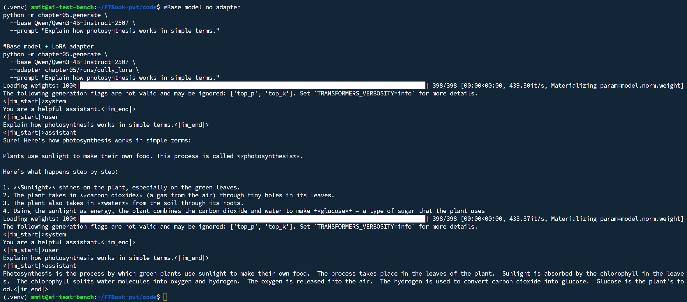
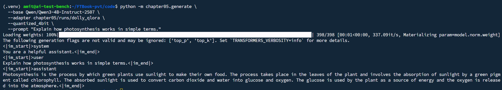

# Example: Base Model vs LoRA Adapter Inference

This example shows the same prompt run with **(1) base model only**, **(2) base model + LoRA adapter**, and **(3) base model + QLoRA adapter**, so you can compare output style and content. Commands are run from the `code/` directory with the virtual environment activated.

## Commands

**Base model (no adapter):**
```bash
python -m chapter05.generate \
  --base Qwen/Qwen3-4B-Instruct-2507 \
  --prompt "Explain how photosynthesis works in simple terms."
```

**Base model + LoRA adapter:**
```bash
python -m chapter05.generate \
  --base Qwen/Qwen3-4B-Instruct-2507 \
  --adapter chapter05/runs/dolly_lora \
  --prompt "Explain how photosynthesis works in simple terms."
```

**Base model + QLoRA adapter (use `--quantized_4bit`):**
```bash
python -m chapter05.generate \
  --base Qwen/Qwen3-4B-Instruct-2507 \
  --adapter chapter05/runs/dolly_qlora \
  --quantized_4bit \
  --prompt "Explain how photosynthesis works in simple terms."
```

## Base model output (no adapter)

Raw output includes the chat template tokens. The model gives a longer, step-by-step style and may be truncated by `--max_new_tokens` (default 128):

```
<|im_start|>system
You are a helpful assistant.<|im_end|>
<|im_start|>user
Explain how photosynthesis works in simple terms.<|im_end|>
<|im_start|>assistant
Sure! Here's how photosynthesis works in simple terms:

Plants use sunlight to make their own food. This process is called **photosynthesis**.

Here's what happens step by step:

1. **Sunlight** shines on the plant, especially on the green leaves.
2. The plant takes in **carbon dioxide** (a gas from the air) through tiny holes in its leaves.
3. The plant also takes in **water** from the soil through its roots.
4. Using the sunlight as energy, the plant combines the carbon dioxide and water to make **glucose** — a type of sugar that the plant uses
```

## Base model + LoRA adapter output

The fine-tuned model often produces a more concise, direct answer in one paragraph (same prompt, same default max_new_tokens):

```
<|im_start|>system
You are a helpful assistant.<|im_end|>
<|im_start|>user
Explain how photosynthesis works in simple terms.<|im_end|>
<|im_start|>assistant
Photosynthesis is the process by which green plants use sunlight to make their own food.  The process takes place in the leaves of the plant.  Sunlight is absorbed by the chlorophyll in the leaves.  The chlorophyll splits water molecules into oxygen and hydrogen.  The oxygen is released into the air.  The hydrogen is used to convert carbon dioxide into glucose.  Glucose is the plant's food.<|im_end|>
```

## Base model + QLoRA adapter output

When using a QLoRA-trained adapter, you must pass **`--quantized_4bit`** so the base model is loaded in 4-bit (matching training). Output is again concise and completes within the token limit:

```
<|im_start|>system
You are a helpful assistant.<|im_end|>
<|im_start|>user
Explain how photosynthesis works in simple terms.<|im_end|>
<|im_start|>assistant
Photosynthesis is the process by which green plants use sunlight to make their own food. The process takes place in the leaves of the plant and involves the absorption of sunlight by a green pigment called chlorophyll. The absorbed sunlight is used to convert carbon dioxide and water into glucose and oxygen. The glucose is used by the plant as a source of energy and the oxygen is released into the atmosphere.<|im_end|>
```

## What to notice

- **Base:** More conversational opener ("Sure! Here's how..."), bullet list, response can hit token limit.
- **LoRA adapter:** More direct, single paragraph, completes within the limit and ends with `<|im_end|>`.
- **QLoRA adapter:** Same style as LoRA; requires `--quantized_4bit` so the base is loaded in 4-bit. Slightly different wording (e.g. "green pigment called chlorophyll", "released into the atmosphere") but equally correct.
- All three answers are correct; both adapters reflect the style and concision of the Dolly training data.

## Screenshots (terminal output)

**Base vs LoRA adapter:**


**QLoRA inference** (same prompt, with `--quantized_4bit`):

