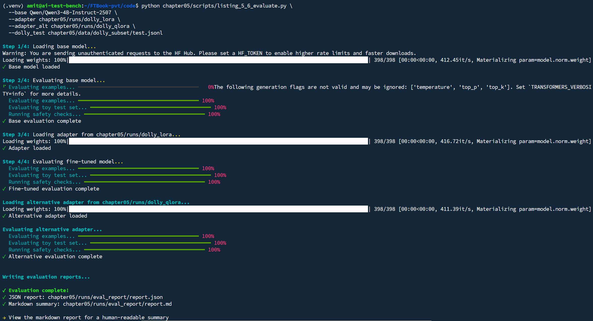

# Example: LoRA vs QLoRA Evaluation Output

This file captures a typical run of the evaluation script when comparing the **base model**, **LoRA adapter** (`dolly_lora`), and **QLoRA adapter** (`dolly_qlora`) on the same test set. Use it to recognize normal output and the order of steps.

## Command

```bash
python chapter05/scripts/listing_5_4_evaluate.py \
  --base Qwen/Qwen3-4B-Instruct-2507 \
  --adapter chapter05/runs/dolly_lora \
  --adapter_alt chapter05/runs/dolly_qlora \
  --dolly_test chapter05/data/dolly_subset/test.jsonl
```

## Raw output

```
Step 1/4: Loading base model...
Warning: You are sending unauthenticated requests to the HF Hub. Please set a HF_TOKEN to enable higher rate limits and faster downloads.
Loading weights: 100%|███████████████████████████████████████████████████████████████████████████████████████████████████| 398/398 [00:00<00:00, 412.45it/s, Materializing param=model.norm.weight]
✓ Base model loaded

Step 2/4: Evaluating base model...
⠋ Evaluating examples... ━━━━━━━━━━━━━━━━━━━━━━━━━━━━━━━━━━━━━━━━   0%The following generation flags are not valid and may be ignored: ['temperature', 'top_p', 'top_k']. Set `TRANSFORMERS_VERBOSITY=info` for more details.
  Evaluating examples... ━━━━━━━━━━━━━━━━━━━━━━━━━━━━━━━━━━━━━━━━ 100%
  Evaluating toy test set... ━━━━━━━━━━━━━━━━━━━━━━━━━━━━━━━━━━━━━━━━ 100%
  Running safety checks... ━━━━━━━━━━━━━━━━━━━━━━━━━━━━━━━━━━━━━━━━ 100%
✓ Base evaluation complete

Step 3/4: Loading adapter from chapter05/runs/dolly_lora...
Loading weights: 100%|███████████████████████████████████████████████████████████████████████████████████████████████████| 398/398 [00:00<00:00, 416.72it/s, Materializing param=model.norm.weight]
✓ Adapter loaded

Step 4/4: Evaluating fine-tuned model...
  Evaluating examples... ━━━━━━━━━━━━━━━━━━━━━━━━━━━━━━━━━━━━━━━━ 100%
  Evaluating toy test set... ━━━━━━━━━━━━━━━━━━━━━━━━━━━━━━━━━━━━━━━━ 100%
  Running safety checks... ━━━━━━━━━━━━━━━━━━━━━━━━━━━━━━━━━━━━━━━━ 100%
✓ Fine-tuned evaluation complete

Loading alternative adapter from chapter05/runs/dolly_qlora...
Loading weights: 100%|███████████████████████████████████████████████████████████████████████████████████████████████████| 398/398 [00:00<00:00, 411.39it/s, Materializing param=model.norm.weight]
✓ Alternative adapter loaded

Evaluating alternative adapter...
  Evaluating examples... ━━━━━━━━━━━━━━━━━━━━━━━━━━━━━━━━━━━━━━━━ 100%
  Evaluating toy test set... ━━━━━━━━━━━━━━━━━━━━━━━━━━━━━━━━━━━━━━━━ 100%
  Running safety checks... ━━━━━━━━━━━━━━━━━━━━━━━━━━━━━━━━━━━━━━━━ 100%
✓ Alternative evaluation complete


Writing evaluation reports...

✓ Evaluation complete!
✓ JSON report: chapter05/runs/eval_report/report.json
✓ Markdown summary: chapter05/runs/eval_report/report.md

→ View the markdown report for a human-readable summary
```

## What this means

| Output | Meaning |
|--------|---------|
| **Step 1/4: Loading base model** | Base model (Qwen3-4B) is loaded once. HF warning is optional (set `HF_TOKEN` for higher limits). |
| **Step 2/4: Evaluating base model** | Dolly test set (instruction-following), toy test set, and safety suite run on the base model only. Progress bars show completion. |
| **Step 3/4: Loading adapter** | LoRA adapter (`dolly_lora`) is attached to the same base. |
| **Step 4/4: Evaluating fine-tuned model** | Same three evals (Dolly, toy, safety) run with the LoRA adapter. |
| **Loading alternative adapter** | QLoRA adapter (`dolly_qlora`) is loaded (base is reloaded and this adapter is attached). |
| **Evaluating alternative adapter** | Same three evals run with the QLoRA adapter. |
| **Writing evaluation reports** | Results are written to `chapter05/runs/eval_report/report.json` and `report.md`. |

**Summary:** The script evaluates base → LoRA → QLoRA in sequence and writes a single report that compares all three. Open `chapter05/runs/eval_report/report.md` for the human-readable summary. For a full example of that report (base vs LoRA vs QLoRA) and how to interpret each section and metric, see [example_eval_report_lora_vs_qlora.md](example_eval_report_lora_vs_qlora.md).

## Screenshot (terminal / report)


