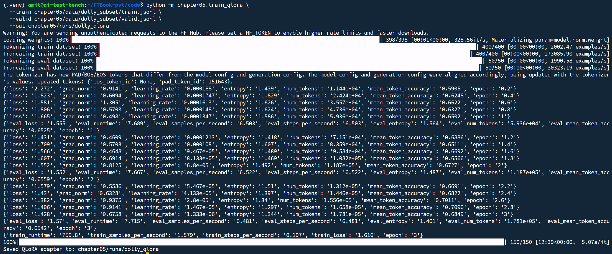
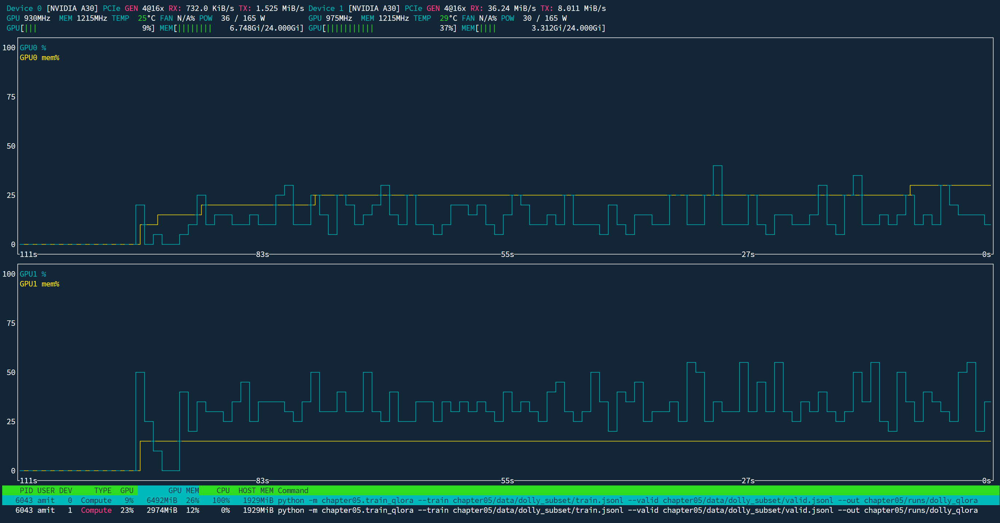

# Example: QLoRA Training Output

This file captures a typical run of `train_qlora` for the Chapter 5 Dolly subset (400 train, 50 valid, 3 epochs). Use it to recognize normal output and interpret the metrics.

## Command

```bash
python -m chapter05.train_qlora \
  --train chapter05/data/dolly_subset/train.jsonl \
  --valid chapter05/data/dolly_subset/valid.jsonl \
  --out chapter05/runs/dolly_qlora
```

## Raw output

```
Warning: You are sending unauthenticated requests to the HF Hub. Please set a HF_TOKEN to enable higher rate limits and faster downloads.
Loading weights: 100%|███████████████████████████████████████████████████████████████████████████████████████████████████| 398/398 [00:01<00:00, 328.56it/s, Materializing param=model.norm.weight]
Tokenizing train dataset: 100%|█████████████████████████████████████████████████████████████████████████████████████████████████████████████████████████| 400/400 [00:00<00:00, 2002.47 examples/s]
Truncating train dataset: 100%|███████████████████████████████████████████████████████████████████████████████████████████████████████████████████████| 400/400 [00:00<00:00, 173085.90 examples/s]
Tokenizing eval dataset: 100%|████████████████████████████████████████████████████████████████████████████████████████████████████████████████████████████| 50/50 [00:00<00:00, 1990.58 examples/s]
Truncating eval dataset: 100%|███████████████████████████████████████████████████████████████████████████████████████████████████████████████████████████| 50/50 [00:00<00:00, 30323.19 examples/s]
The tokenizer has new PAD/BOS/EOS tokens that differ from the model config and generation config. The model config and generation config were aligned accordingly, being updated with the tokenizer's values. Updated tokens: {'bos_token_id': None, 'pad_token_id': 151643}.
{'loss': '2.272', 'grad_norm': '0.9141', 'learning_rate': '0.000188', 'entropy': '1.439', 'num_tokens': '1.144e+04', 'mean_token_accuracy': '0.5905', 'epoch': '0.2'}
{'loss': '1.823', 'grad_norm': '0.6094', 'learning_rate': '0.0001747', 'entropy': '1.829', 'num_tokens': '2.424e+04', 'mean_token_accuracy': '0.6248', 'epoch': '0.4'}
{'loss': '1.581', 'grad_norm': '1.305', 'learning_rate': '0.0001613', 'entropy': '1.626', 'num_tokens': '3.557e+04', 'mean_token_accuracy': '0.6622', 'epoch': '0.6'}
{'loss': '1.806', 'grad_norm': '0.5703', 'learning_rate': '0.000148', 'entropy': '1.624', 'num_tokens': '4.736e+04', 'mean_token_accuracy': '0.6327', 'epoch': '0.8'}
{'loss': '1.665', 'grad_norm': '0.498', 'learning_rate': '0.0001347', 'entropy': '1.586', 'num_tokens': '5.936e+04', 'mean_token_accuracy': '0.6502', 'epoch': '1'}
{'eval_loss': '1.555', 'eval_runtime': '7.689', 'eval_samples_per_second': '6.503', 'eval_steps_per_second': '6.503', 'eval_entropy': '1.564', 'eval_num_tokens': '5.936e+04', 'eval_mean_token_accuracy': '0.6525', 'epoch': '1'}
{'loss': '1.431', 'grad_norm': '0.4609', 'learning_rate': '0.0001213', 'entropy': '1.418', 'num_tokens': '7.151e+04', 'mean_token_accuracy': '0.6886', 'epoch': '1.2'}
{'loss': '1.709', 'grad_norm': '0.5703', 'learning_rate': '0.000108', 'entropy': '1.607', 'num_tokens': '8.359e+04', 'mean_token_accuracy': '0.6511', 'epoch': '1.4'}
{'loss': '1.566', 'grad_norm': '0.4648', 'learning_rate': '9.467e-05', 'entropy': '1.489', 'num_tokens': '9.584e+04', 'mean_token_accuracy': '0.6692', 'epoch': '1.6'}
{'loss': '1.607', 'grad_norm': '0.6914', 'learning_rate': '8.133e-05', 'entropy': '1.469', 'num_tokens': '1.082e+05', 'mean_token_accuracy': '0.6566', 'epoch': '1.8'}
{'loss': '1.552', 'grad_norm': '0.8125', 'learning_rate': '6.8e-05', 'entropy': '1.492', 'num_tokens': '1.187e+05', 'mean_token_accuracy': '0.6727', 'epoch': '2'}
{'eval_loss': '1.552', 'eval_runtime': '7.667', 'eval_samples_per_second': '6.522', 'eval_steps_per_second': '6.522', 'eval_entropy': '1.487', 'eval_num_tokens': '1.187e+05', 'eval_mean_token_accuracy': '0.6559', 'epoch': '2'}
{'loss': '1.579', 'grad_norm': '0.5586', 'learning_rate': '5.467e-05', 'entropy': '1.51', 'num_tokens': '1.312e+05', 'mean_token_accuracy': '0.6691', 'epoch': '2.2'}
{'loss': '1.43', 'grad_norm': '0.6328', 'learning_rate': '4.133e-05', 'entropy': '1.397', 'num_tokens': '1.446e+05', 'mean_token_accuracy': '0.6822', 'epoch': '2.4'}
{'loss': '1.382', 'grad_norm': '0.9375', 'learning_rate': '2.8e-05', 'entropy': '1.34', 'num_tokens': '1.556e+05', 'mean_token_accuracy': '0.7011', 'epoch': '2.6'}
{'loss': '1.406', 'grad_norm': '0.9141', 'learning_rate': '1.467e-05', 'entropy': '1.297', 'num_tokens': '1.658e+05', 'mean_token_accuracy': '0.7096', 'epoch': '2.8'}
{'loss': '1.428', 'grad_norm': '0.6758', 'learning_rate': '1.333e-06', 'entropy': '1.344', 'num_tokens': '1.781e+05', 'mean_token_accuracy': '0.6849', 'epoch': '3'}
{'eval_loss': '1.57', 'eval_runtime': '7.715', 'eval_samples_per_second': '6.481', 'eval_steps_per_second': '6.481', 'eval_entropy': '1.401', 'eval_num_tokens': '1.781e+05', 'eval_mean_token_accuracy': '0.6542', 'epoch': '3'}
{'train_runtime': '759.8', 'train_samples_per_second': '1.579', 'train_steps_per_second': '0.197', 'train_loss': '1.616', 'epoch': '3'}
100%|████████████████████████████████████████████████████████████████████████████████████████████████████████████████████████████████████████████████████████████| 150/150 [12:39<00:00,  5.07s/it]
Saved QLoRA adapter to: chapter05/runs/dolly_qlora
```

## What this means

| Output | Meaning |
|--------|---------|
| **HF Hub warning** | You're not using a Hugging Face token. Downloads still work; setting `HF_TOKEN` gives higher rate limits and faster downloads. Optional. |
| **Loading weights (398/398)** | The base model is being loaded in **4-bit** (quantized). The bar is over the 398 layers/module parts. "Materializing" means building the quantized tensors. |
| **Tokenizing / Truncating** | Train and eval datasets are converted to token IDs and truncated to `max_length`. Fast and expected. |
| **Tokenizer PAD/BOS/EOS message** | Qwen often has no explicit PAD token; the trainer sets `pad_token_id` (e.g. to EOS) and updates the config. **Expected and harmless**—training and generation work correctly. |
| **loss** | Training loss (cross-entropy). Should generally **decrease** over epochs (e.g. 2.27 → 1.43). Small ups and downs are normal. |
| **grad_norm** | Gradient norm; reflects update size. Stable values (e.g. 0.5–1.0) indicate healthy training. |
| **learning_rate** | Current learning rate (scheduler reduces it over time). Starts around 2e-4 and decays by end of epoch 3. |
| **mean_token_accuracy** | Fraction of next-token predictions that match the target. **Rough proxy for quality**—rising (e.g. 0.59 → 0.68) suggests the model is learning. |
| **eval_loss / eval_mean_token_accuracy** | Validation metrics at the end of each epoch. Used to monitor overfitting; similar to train metrics is a good sign. |
| **train_runtime: 759.8** | Total training time in **seconds** (~12.7 minutes). `train_samples_per_second` and the progress bar (150 steps, 5.07 s/step) confirm pace. |
| **Saved QLoRA adapter to: ...** | Adapter weights written to `chapter05/runs/dolly_qlora`. Use this path for evaluation (Step 3) and inference with `--adapter` and `--quantized_4bit`. |

**Summary:** Loss and token accuracy improve over 3 epochs, validation tracks training, and the run finishes by saving the adapter. The tokenizer message and HF warning are safe to ignore for local runs.

## Screenshots

Training progress and GPU usage from a typical QLoRA run:




